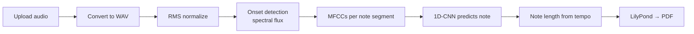

# Convert Audio To Musical Notes 🎹

**NoteMe: where sound meets score.**
A full-stack project for music lovers: upload a piano recording and get it back as printable sheet music (PDF).

This was my first venture into training a machine learning model. It combines backend work, a model I trained myself, and frontend design in one easy-to-use app. It is a learning project that demonstrates the concepts, not a production-ready product.

| | |
|---|---|
| **Input** | A piano recording (`.wav`, `.mp3` or `.m4a`, up to 10 MB) |
| **Processing** | Onset detection plus a 1D-CNN trained to recognize the 88 piano notes |
| **Output** | Downloadable sheet music (PDF) with treble and bass staves, engraved by LilyPond |

> The model reaches about **68% accuracy** on single piano notes. Results are best with clean recordings of one note at a time.

---

## Contents

- [Features](#features)
- [Project structure](#project-structure)
- [How it works](#how-it-works)
- [Model training](#model-training)
- [Running the project](#running-the-project)
- [API](#api)
- [Validation & security](#validation--security)
- [Troubleshooting](#troubleshooting)

---

## Features

- 🎙️ **Drag-and-drop upload** with a preview player and a 3-step progress indicator (Upload → Convert → Save & download)
- ⏱️ **Live conversion progress**: a timer, an animated equalizer and status messages for each stage
- 🎼 **PDF download** of the generated score
- 💾 **My Songs**: save recordings, search them, play them, get their sheet music again, or delete them (with a confirmation step)
- 🔐 **Accounts** with strong validation, hashed passwords and a lockout after repeated failed logins
- 🌙 **Light and dark mode**, a layout that adapts to phones, and pop-up notifications
- 🎹 A **mini piano** you can play on the start page (mouse, or keys A–K)

---

## Project structure

```
├── Front/                       # React 18 client (Create React App)
│   ├── public/
│   ├── src/
│   │   ├── components/          # Navbar, Landing, LogIn, SignUp, HomePage, History, About, ...
│   │   ├── context/             # logged-in user + toast notifications
│   │   ├── utils/validation.js  # shared form validation rules
│   │   ├── api.js               # server calls
│   │   └── index.css            # styles (light + dark theme)
│   └── package.json
├── Server/                      # Flask API + audio → notes → PDF pipeline
│   ├── mongoDB.py               # API entry point (users, songs, upload, download)
│   ├── main.py                  # transcription pipeline
│   └── requirements.txt
├── Model training/
│   ├── project/
│   │   ├── try1.py              # training script
│   │   ├── audio_classification2.hdf5  # trained model used by the server
│   │   └── label_encoder.pkl    # maps model outputs ↔ note names
│   ├── metadata/
│   │   ├── 88notesMetadata_train.csv     # training set (1,051 recordings)
│   │   └── piano_notes_test_metadata.csv # test set (210 recordings)
│   └── requirements.txt
├── example metadata.csv         # small example of the metadata format
└── LICENSE
```

---

## How it works



1. **Convert**: `.mp3` and `.m4a` files are converted to WAV with pydub/FFmpeg.
2. **Normalize**: the volume is RMS-normalized to a fixed level, so loudness doesn't affect the features.
3. **Detect where notes start**: spectral-flux onset detection with `librosa.onset`. The onset times are written to `onset_times.txt`.
4. **Classify each note**: for the audio between two onsets, the server computes 40 MFCCs, averages them over time, and the trained model predicts the note (for example `C_4` or `FS_5`).
5. **Note lengths**: `librosa.beat.beat_track` estimates the tempo. Each segment's length is mapped to a whole, half, quarter, eighth or sixteenth note.
6. **Engrave**: notes in octave 4 and above go on the treble staff, lower notes on the bass staff. The result is written as LilyPond code and compiled to PDF.

---

## Model training

The training code lives in [`Model training/project/try1.py`](Model%20training/project/try1.py).

### Dataset

Each sample is a WAV recording of **one piano note**. The metadata CSVs list each file and its label:

```csv
FileName,Class
0-a.wav,A_0
0-as.wav,AS_0
4-c.wav,C_4
```

| | File | Recordings |
|---|---|---|
| Training set | [`metadata/88notesMetadata_train.csv`](Model%20training/metadata/88notesMetadata_train.csv) | 1,051 |
| Test set | [`metadata/piano_notes_test_metadata.csv`](Model%20training/metadata/piano_notes_test_metadata.csv) | 210 |

- **88 classes**, one per piano key, from `A_0` to `C_8`.
- **Label format**: `<Note>_<Octave>`, where `S` means sharp. For example, `CS_4` is C♯4 and `A_4` is A4 (440 Hz).
- Each class has between 3 and 18 training recordings, about 12 on average.
- The recordings came from a "piano 88 notes" dataset and the University of Iowa Musical Instrument Samples. The audio files are **not** included in this repo because of their size and licensing. Only the metadata is included.

### Features

Each recording becomes a single **40-value feature vector**:

```python
audio, sr = librosa.load(file, res_type='kaiser_fast')
mfccs = librosa.feature.mfcc(y=audio, sr=sr, n_mfcc=40)  # shape (40, frames)
features = np.mean(mfccs.T, axis=0)                      # shape (40,)
```

Labels are converted to numbers with scikit-learn's `LabelEncoder` and one-hot encoded. The fitted encoder is saved as `label_encoder.pkl`, so the server can turn predictions back into note names.

### Architecture (1D CNN)

| Layer | Details |
|---|---|
| Input | 40 MFCC values |
| Conv1D | 64 filters, kernel 3, ReLU |
| MaxPooling1D | pool 2 |
| Conv1D | 128 filters, kernel 3, ReLU |
| MaxPooling1D | pool 2 |
| Conv1D | 256 filters, kernel 3, ReLU |
| MaxPooling1D | pool 2 |
| GlobalAveragePooling1D | |
| Dense | 128, ReLU |
| Dropout | 0.3 |
| Dense | 88, softmax |

- **Loss**: categorical cross-entropy. **Optimizer**: Adam.
- **100 epochs**, batch size 32. The test set is used for validation.
- A `ModelCheckpoint(save_best_only=True)` callback keeps the weights with the best validation loss.
- **Result**: about **68% test accuracy**.

At the end, the script also plots the training and validation accuracy and loss.

### Retraining the model

1. Put your WAV files in a folder, and list them in CSVs with the same `FileName,Class` format as the files in `Model training/metadata/`.
2. Install the training dependencies (Python 3.11):
   ```bash
   cd "Model training"
   py -3.11 -m pip install -r requirements.txt
   ```
3. In `project/try1.py`, set:
   - the metadata paths (`pd.read_csv(...)`). They already point to `../metadata/`.
   - `pathToYourTrainDatasetFolder/` and `pathToYourTestDatasetFolder/` to your audio folders.
   - `audioExample.wav` to any recording, for the example prediction at the end.
4. Run it from the `project` folder:
   ```bash
   cd project
   py -3.11 try1.py
   ```
5. The script saves `audio_classification.hdf5` and `label_encoder.pkl`. The server loads `audio_classification2.hdf5`, so either rename the new model to that name, or point the server at it with an environment variable:
   ```bash
   set NOTEME_MODEL=C:\path\to\audio_classification.hdf5
   set NOTEME_LABEL_ENCODER=C:\path\to\label_encoder.pkl
   ```

**Always replace the model and the label encoder together.** The encoder decides which output index belongs to which note.

---

## Running the project

### Prerequisites

| Tool | Notes |
|---|---|
| [Node.js](https://nodejs.org) 18+ | for the React client |
| [Python 3.11](https://www.python.org) | TensorFlow 2.15 needs Python ≤ 3.11 |
| [MongoDB Community Server](https://www.mongodb.com/try/download/community) | running on `localhost:27017` |
| [LilyPond 2.24+](https://lilypond.org/download.html) | the `lilypond` command must be on your `PATH` |
| [FFmpeg](https://ffmpeg.org/download.html) | on your `PATH`, needed to read `.mp3` and `.m4a` |

> **Windows tip:** LilyPond comes with its own `python.exe`. If its folder is listed first in `PATH`, typing `python` starts the wrong Python, and you'll see errors like `No module named venv` or `No module named flask`. Use the launcher instead: `py -3.11`.

### 1. Server (terminal 1)

```bash
cd Server
py -3.11 -m pip install -r requirements.txt
py -3.11 mongoDB.py
```

Wait for `Running on http://127.0.0.1:5000`. The server finds the trained model in `Model training/project/` automatically.

### 2. Client (terminal 2)

```bash
cd Front
npm install
npm start
```

The app opens at **http://localhost:3000**. Sign up, log in, and convert your first recording.

### Tests

```bash
cd Front
npm test
```

---

## API

Base URL: `http://localhost:5000`

| Method | Route | Body | Description |
|---|---|---|---|
| POST | `/add_user` | `userName`, `email`, `password` | Create an account |
| POST | `/login` | `email`, `password` | Log in |
| POST | `/uploadAudio` | form field `file` | Convert a recording to PDF |
| GET | `/downloadPdf` | | Download the latest PDF |
| POST | `/add_song` | `songName`, `fileName`, `filePath`, `userId` | Save a song |
| GET | `/songs/<userId>` | | List a user's songs |
| DELETE | `/remove_song` | `songId`, `userId` | Delete a song |

Errors are returned as `{"message": "..."}` with a matching HTTP status (400, 401, 404, 409, 413, 429 or 500).

---

## Validation & security

The browser and the server both check every rule:

| Field | Rules |
|---|---|
| Username | 3–20 characters. Starts with a letter. Allowed: letters, numbers, spaces, `_ . -` |
| Email | Valid format, unique (not case-sensitive) |
| Password | 8–32 characters with a lowercase letter, an uppercase letter, a number and a special character. No spaces. Can't contain the username or email |
| Song name | 1–40 characters, no `<` or `>` |
| Audio | `.wav`, `.mp3` or `.m4a`, up to 10 MB |

- Passwords are stored as **scrypt hashes**. Older plain-text passwords are upgraded to a hash automatically on the next login.
- After **5 failed logins**, that email is locked for 5 minutes.
- Uploaded files are saved under random names. Their original file names are never used as paths.

---

## Troubleshooting

| Problem | Fix |
|---|---|
| `No module named venv` / `No module named flask` | You are running LilyPond's Python. Use `py -3.11` |
| `Couldn't find any of: ... audio_classification2.hdf5` | Keep the `Model training` folder next to `Server`, or set `NOTEME_MODEL` |
| `ServerSelectionTimeoutError` | Start MongoDB (Windows: Services → MongoDB → Start) |
| "Can't reach the NoteMe server" in the browser | Start the server, and make sure port 5000 is free |
| PDF generation failed | Install LilyPond and add its `bin` folder to `PATH` |
| `.mp3` / `.m4a` won't convert | Install FFmpeg and add it to `PATH` |
| `ModuleNotFoundError: moviepy.editor` | `py -3.11 -m pip install "moviepy<2.0"` |

---

## License

[MIT](LICENSE) © 2024 shoams12
